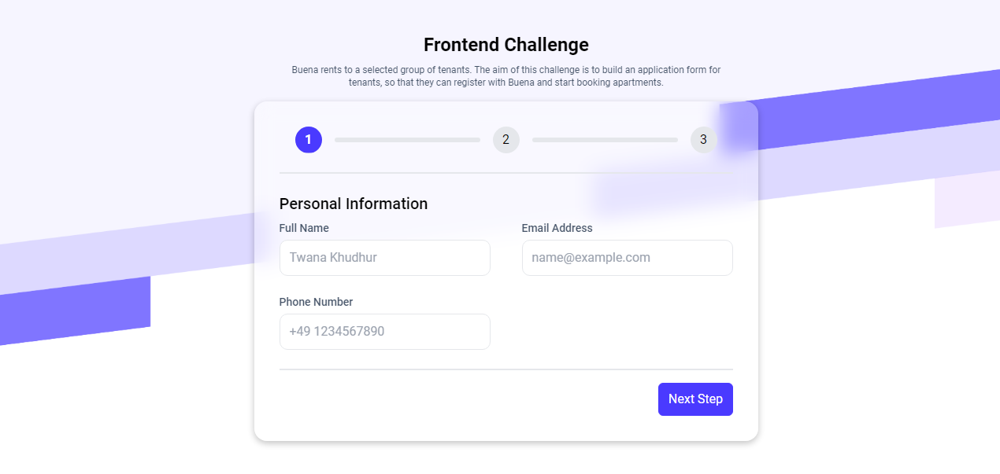
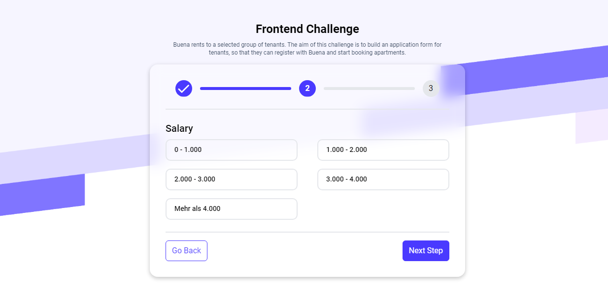
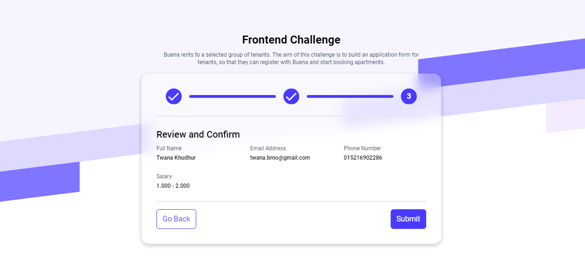
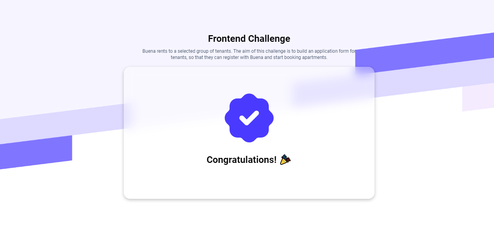
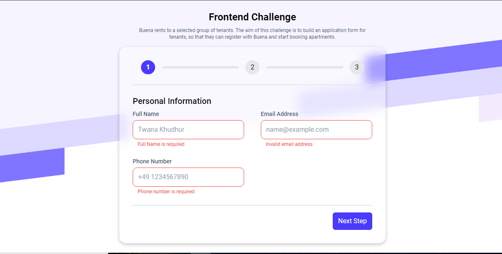

# Multi-Step Form

A multi-step form built with React, TypeScript, Framer Motion, and React Hook Form
Project created as a part of Buena's Frontend Challenge.

### [live demo](https://multistepform-challenge.netlify.app/)


## 🚀 Features
**Multi-Step Navigation:** Navigate through multiple steps with validation on each step.

**Smooth Transitions:** Animated transitions between steps using Framer Motion.

**Validation:** Form validation powered by React Hook Form and Zod.

**Progress Indicator:** A progress bar shows the user's current step and form completion state.

**Responsive Design:** Built with Tailwind CSS to work seamlessly across devices.


## 🛠️ Technologies Used
**React :** For building the user interface.

**TypeScript :** Ensures type safety.

**React Hook Form :** For efficient form handling.

**Zod :** Schema validation for form inputs.

**Framer Motion :** For animations and transitions.

**Tailwind CSS :** For fast and responsive styling.

**Vite :** For quick development builds and smooth workflow.


## ⚙️ Setup Instructions

```
git clone https://github.com/twanakhudhur/multi-step-form.git

cd multi-steps-form

npm install
# or
yarn install


# Build and Preview

npm run build
# or
yarn build

npm run preview
# or
yarn preview


# Run development

npm run dev
# or
yarn dev

```

## 📝 Key Functionalities
**Step Navigation:**
Each form step is validated before proceeding to the next step. If validation fails, the user cannot proceed.

**Animated Transitions:**
Transitions between steps are animated for a smooth user experience, thanks to Framer Motion.

**Form Validation:**
Validation is done on the client side using React Hook Form and Zod for schema-based validation. This ensures that the input data is valid before submission.

**Progress Bar:**
A visual progress bar helps the user understand how far they are in the form completion process.


## 📸 Preview

### Step 1: User Information Form


### Step 2: Salary Input Form


### Step 3: Review and Confirm


### Step 4: Congratulations


### Validation Error



## 🛡️ Conclusion

This project demonstrates how to build a multi-step form with validation and smooth animations, incorporating modern React practices, TypeScript, and animations. It also showcases responsive design and code quality by integrating ESLint for linting and maintaining code standards.

Feel free to reach out if you have any questions or feedback!

## 📧 Contact
Email: twana.brno@gmail.com

LinkedIn: https://www.linkedin.com/in/twanakhudhur/


